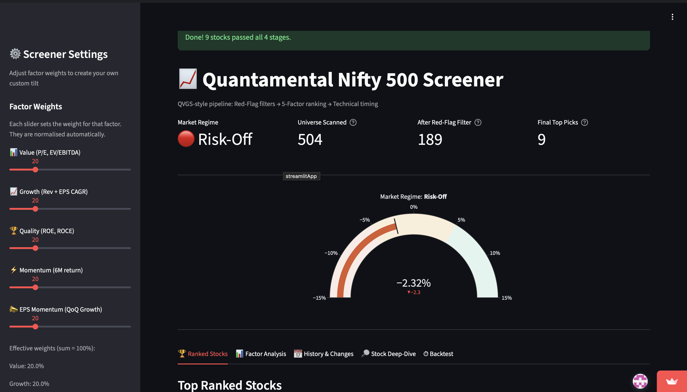

# Quantamental Nifty 500 Screener

**A 5-stage QVGS-style stock screener for the Indian market**


[](https://bhavna1434-quantamental-nifty500-screener.streamlit.app)

<p align="center">
  
</p>

---

## What This Is

A quantamental stock screener that combines systematic fundamental analysis — Piotroski F-Score, Altman Z''-Score, and a 5-factor cross-sectional model — with technical timing signals to filter the full Nifty 500 universe down to a ranked shortlist of actionable ideas. The pipeline follows a Red-Flag → Yellow-Flag → Green-Flag methodology common among quantitative equity funds: first eliminate structurally weak businesses, then rank survivors by factor quality, then confirm with price-based entry signals. Built as a portfolio project targeting quantitative equity research roles, May–July 2026.

---

## The 5-Stage Pipeline

```
Nifty 500 (504 stocks)
      │
      ▼
Stage 1 · Market Regime Detection
         200-day MA on Nifty 50 + market breadth %
         → Risk-On / Neutral / Risk-Off classification
      │
      ▼
Stage 2 · Red-Flag Filter
         Piotroski F-Score ≥ 5
         Altman Z''-Score ≥ 1.10 (not in Distress zone)
         ROCE ≥ sector floor · D/E ≤ sector ceiling
         Interest Coverage ≥ 1.5x · Promoter Pledge ≤ 20%
         Market Cap ≥ ₹500 Cr · Avg Daily Liquidity ≥ ₹5 Cr
      │
      ▼
Stage 3 · Factor Model  (cross-sectional z-scores, equal-weighted)
         Value     — P/E + EV/EBITDA (lower is better)
         Growth    — 3Y Revenue CAGR + 3Y EPS CAGR
         Quality   — ROE + ROCE
         Momentum  — 6M price return, skipping most recent month
         EPS Mom   — QoQ EPS acceleration (recency-decayed)
      │
      ▼
Stage 4 · Technical Filter (Green-Flag entry signals)
         RSI < 70  ·  Price above 50-day MA
         Within 20% of 52-week high
      │
      ▼
Stage 5 · Streamlit Dashboard
         Ranked table with factor sliders
         Sector concentration analysis
         Factor attribution + correlation heatmap
         Week-over-week history log (SQLite + CSV persistence)
         Per-stock PDF tearsheets
         Momentum backtest vs Nifty 500
```

---

## Academic Foundation

| Paper | Role in Model | Key Finding |
| --- | --- | --- |
| Piotroski (2000) | Red-Flag gate — financial health | 9-point F-Score separates improving from deteriorating value stocks; long-short earns ~23% annually |
| Altman (1968, 1995) | Red-Flag gate — solvency | Z-Score and Z''-Score predict corporate bankruptcy 1–2 years in advance |
| Jegadeesh & Titman (1993) | Momentum factor | Stocks with strong 3–12M returns continue to outperform over the next 3–12M |
| Fama & French (1992) | Value factor | Book-to-market ratio explains cross-sectional returns beyond market beta (size factor documented but not implemented here) |
| Ball & Brown (1968) | EPS Momentum factor | Earnings surprises drive post-announcement price drift (PEAD) for 30–60 days |

---

## Data Sources

- **Price data:** Yahoo Finance via `yfinance` — NSE tickers with `.NS` suffix; bulk downloads for speed
- **Fundamentals:** Screener.in — scraped with `requests` + `BeautifulSoup4`; results cached locally for 7 days to avoid repeated scraping

---

## How to Run Locally

```bash
git clone https://github.com/bhavna1434/Quantamental-nifty500-screener
cd Quantamental-nifty500-screener
python -m venv venv && source venv/bin/activate   # Windows: venv\Scripts\activate
pip install -r requirements.txt
streamlit run app.py
```

> **Note:** The first run scrapes fundamentals for all 500 stocks from Screener.in (~10–15 minutes, ~1.5s delay per request to be polite). Subsequent runs within 7 days load from `data/fundamentals_cache.csv` and complete in under a minute.

---

## Known Limitations

- **Scraper fragility:** The Screener.in scraper will break if the site changes its HTML structure. It is not production-grade — for a live system, replace with Trendlyne Pro or a Bloomberg terminal feed.
- **EPS momentum ≠ PEAD:** The 5th factor measures quarter-over-quarter EPS change, not surprise vs analyst consensus. True PEAD requires paid analyst estimates (Bloomberg, Refinitiv). This is EPS acceleration, not the classical Ball & Brown anomaly.
- **Backtest covers 2019–2024 using momentum factor only; multi-factor backtest not yet implemented.** Results are illustrative, not predictive.
- **No survivorship bias correction** — the Nifty 500 universe used is the current list, which excludes stocks that were delisted or removed during the test period. This likely overstates historical returns.

---

## Documentation

- [Project Roadmap](00_PROJECT_ROADMAP.md) — build plan and full feature set
- [Theory & Methodology](02_THEORY_DEEP_DIVE.md) — the financial theory, formulas, and academic basis for each stage
- [Limitations & Calibration](03_LIMITATIONS_AND_CALIBRATION.md) — known limitations, biases, and India-specific calibration notes

---

## Built By

Bhavna Sharma · bhavnasharma.1404@gmail.com · [GitHub](https://github.com/bhavna1434/Quantamental-nifty500-screener)

Built as a quantitative finance portfolio project, May–July 2026.
